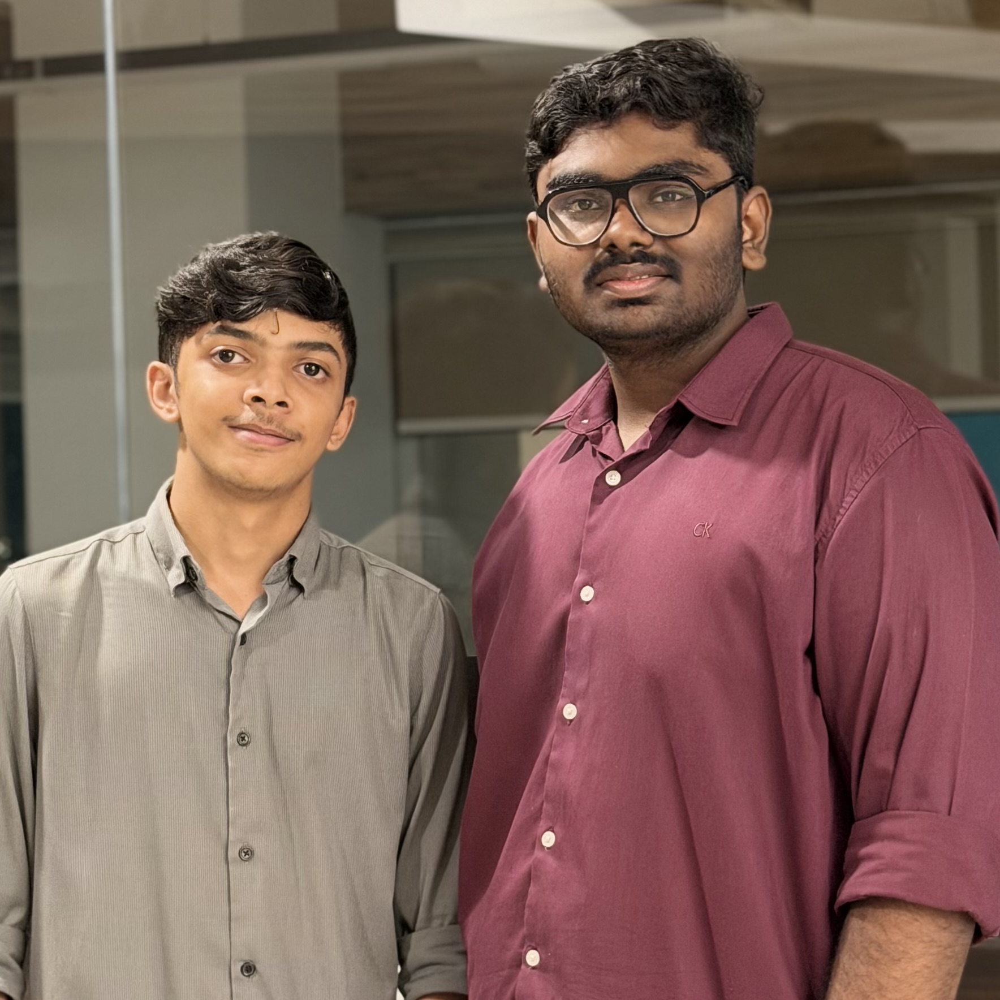
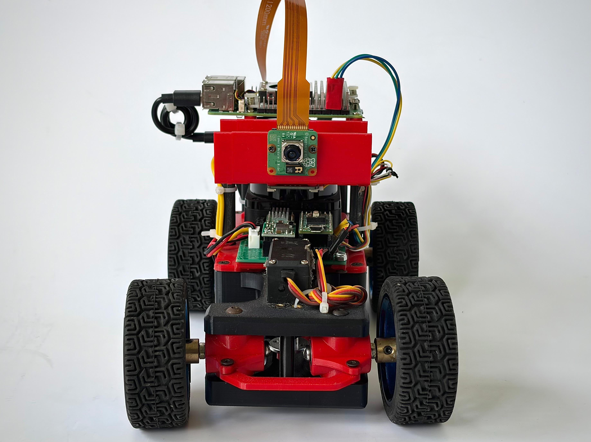
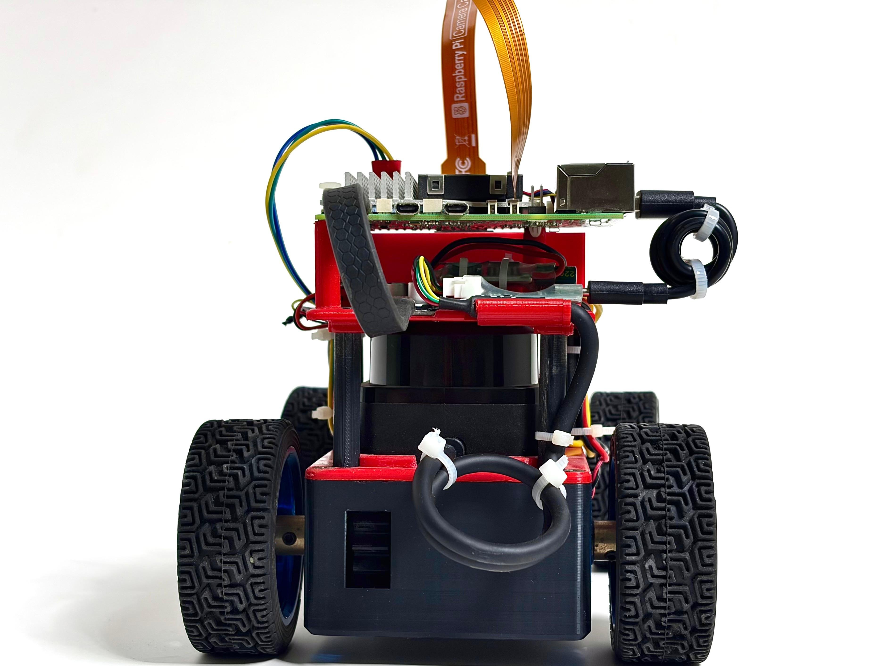
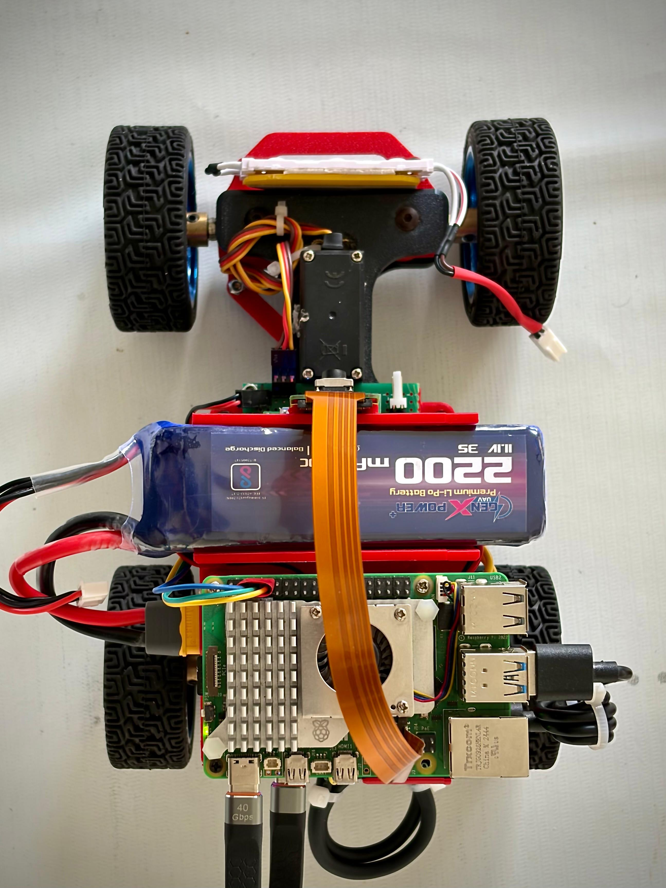
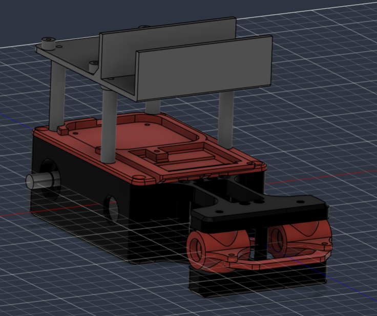

# UWR TechPreneurs  WRO Future Engineers 2026: Self Driving Cars

This repository contains the engineering documentation for **UWR TechPreneurs**' robot for the 2026 World Robot Olympiad Future Engineers competition. The robot was designed and built by a two-student team under the guidance of their coach.

---

## Table of Contents

- [The Team](#the-team)
- [The Challenge](#the-challenge)
- [Photos of the Robot](#photos-of-the-robot)
- [Performance Videos](#performance-videos)
- [Strategy](#strategy)
- [Mobility Management](#mobility-management)
  * [Drivetrain](#drivetrain)
  * [Steering System](#steering-system)
  * [Chassis](#chassis)
- [Power and Sense Management](#power-and-sense-management)
  * [Battery](#battery)
  * [Compute — Raspberry Pi 5 and Teensy 4.0](#compute)
  * [Camera Module](#camera-module)
  * [LiDAR](#lidar)
  * [IMU](#imu)
  * [Bill of Materials (BOM)](#bill-of-materials-bom)
  * [Circuit Diagram](#circuit-diagram)
  * [Power Budget](#power-budget)
- [Software Architecture](#software-architecture)
  * [Sensor Fusion](#sensor-fusion)
  * [Computer Vision](#computer-vision)
  * [Control Systems](#control-systems)
- [Navigation System](#navigation-system)
  * [Open Challenge — State Machine](#open-challenge--state-machine)
  * [Obstacle Challenge — State Machine](#obstacle-challenge--state-machine)
  * [Behaviour](#behaviour-obstacle-challenge-only)
- [Pseudo Code](#pseudo-code)
- [Obstacle Management](#obstacle-management)
  * [Open Challenge Strategy](#open-challenge-strategy)
  * [Obstacle Challenge Strategy](#obstacle-challenge-strategy)
  * [Parking Strategy](#parking-strategy)
- [Build / Compile / Upload Instructions](#build--compile--upload-instructions)
- [Repository Structure](#repository-structure)
- [Cost Report](#cost-report)
- [AI Usage Disclosure](#ai-usage-disclosure)

---

# The Team

### Muhammed Fadhil PP


**Age:** 18

I’m Fadhil, and this is my first time in Future Engineers. We also won gold badge at nationals in Future Innovators. My expertise is hardware and mechanical design. I build the structures and mechanisms that make the robot work.


### Hani Zaman P


**Age:** 18

I’m Hani, and this is my first season in Future Engineers. We won gold badge at nationals in Future Innovators with a fourth-place finish. My expertise is programming and system architecture. I focus on the logic that connects sensors, vision, and hardware into one working system.

### Jithu Joseph

**Role:** Coach

Hi, I’m Jithu. I’m the coach for this team. I mentor the team through strategy, problem-solving, and competition preparation. I bring experience in robotics and guide the team through challenges.

### Team Photo



---

# The Challenge

The **[WRO 2026 Future Engineers Self-Driving Cars](https://wro-association.org/)** challenge invites teams to design, build, and program a robotic vehicle capable of driving autonomously on a track that changes dynamically with each round. The competition includes two main rounds: the **Open Challenge**, where the robot must complete laps while staying within the track boundaries, and the **Obstacle Challenge**, where it must additionally avoid randomly placed red/green traffic pillars and complete a precise parallel parking maneuver.

This challenge emphasizes:

- **Mobility Management** - building a vehicle with precise, reliable steering and speed control.
- **Sense Management** - using sensors effectively to understand the car's position and surroundings.
- **Obstacle Handling** - detecting and correctly responding to traffic-sign pillars.
- **Parking Precision** - executing a parallel-parking maneuver within strict spatial limits.
- **Documentation** - clearly explaining engineering decisions so the robot can be understood and reproduced.

---

# Photos of the Robot

| Front | Back |
|---|---|
|  |  |
| Left | Right |
|  |  |
| Top | |
|  | |

---

# Performance Videos

- 🎥 **Open Challenge:** https://youtu.be/rztB6XzHc4U
- 🎥 **Obstacle Challenge:** https://youtu.be/TNqtxHg5q2g

---

# Strategy

Our overall strategy prioritizes **reliability over raw speed** the robot is tuned to consistently complete a run rather than push maximum velocity at the risk of losing wall-lock or misreading a pillar.

### Open Challenge Strategy

The Open Challenge uses a two sensor fusion approach: **LiDAR** provides distance and geometry of the inner/outer boundary walls, while the **BNO055 IMU** provides continuous, high rate heading. LiDAR derived wall headings (extracted via PCA) periodically re anchor the IMU so heading stays accurate over a full run without drifting, while the IMU keeps the control loop fast between LiDAR corrections.

### Obstacle Challenge Strategy

The Obstacle Challenge strategy layers a **camera based pillar detector** on top of the same wall following core used in the Open Challenge:

1. The camera identifies red/green pillars and magenta parking markers via lab color detection.
2. A tracker (`pillar_tracker.py`) stabilizes noisy per frame detections into one reliable pillar reading.
3. Depending on the pillar's color and whether the robot is on a straight or approaching a corner, the navigator shifts its wall following lane offset left or right to pass the pillar on the correct side.
4. Once both parking markers are visible, a dedicated state sequence executes the parallel parking maneuver.

Camera based pillar avoidance only ever **nudges** the LiDAR/IMU wall following baseline   it never replaces it   which keeps the robot on track even if a pillar is briefly misdetected.

---

# Mobility Management

## Drivetrain

The robot is **rear wheel drive**, powered by a single **Waveshare L shaped permanent magnet DC gear motor** with a built in encoder. Power reaches the rear axle through a **1:1 ratio two gear system** (one gear on the motor shaft, one on the wheel axle)  this offsets the motor from the axle centerline for packaging reasons rather than changing torque/speed, since the ratio is 1:1.

Both rear wheels are rigidly fixed to the same axle/gear   there is **no differential**. This was a deliberate simplification to keep the drivetrain mechanically simple and reliable; the resulting tire scrub during turns was found to be negligible at competition speeds.

The motor is driven by a **Pololu DRV8876** H bridge motor driver, controlled by the Teensy 4.0 based on target RPM commands sent from the Pi. The motor's built in encoder is read directly by the Teensy for closed loop RPM control and tick based odometry.

## Steering System

The front axle uses **true Ackermann steering geometry**, actuated by a single **MG996R** hobby servo through the steering linkage. Ackermann geometry was chosen specifically over simpler parallel/tie rod only steering so that the inner and outer front wheels each point along their correct turning circle tangent  this reduces tire scrub during turns and, in our testing, made the car's actual turning behavior track much more closely with our LiDAR based heading and wall position calculations.

## Chassis

The chassis was **custom designed in Fusion 360** and **3D printed** in house. All CAD files are available in `/models`.

**3D-printed parts** (`/models/3d-printed`):

| Part | Render | STL |
|---|---|---|
| Base |  | [Base.stl](models/3d-printed/Base.stl) |
| Front axle upper cover |  | [Front axle upper cover.stl](<models/3d-printed/Front axle upper cover.stl>) |
| Front steering mechanism (with servo link point) |  | [Front steering mechanism with servo link point.stl](<models/3d-printed/Front steering mechanism with servo link point.stl>) |
| Front steering mechanism (without servo link point) |  | [Front steering mechanism without servo link point.stl](<models/3d-printed/Front steering mechanism without servo link point.stl>) |
| Rear axle |  | [Rear axle.stl](<models/3d-printed/Rear axle.stl>) |
| Rear axle spur gear |  | [Rear axle spur gear.stl](<models/3d-printed/Rear axle spur gear.stl>) |
| Motor spur gear |  | [motor spur gear.stl](<models/3d-printed/motor spur gear.stl>) |
| Center support beams |  | [center support beams.stl](<models/3d-printed/center support beams.stl>) |
| Links |  | [links.stl](models/3d-printed/links.stl) |
| Top cover v2 |  | [top cover v2.stl](<models/3d-printed/top cover v2.stl>) |
| Top-most layer v2 |  | [top most layer v2.stl](<models/3d-printed/top most layer v2.stl>) |

**Full assembly** (`/models/Assembly`):

| Render | STEP File |
|---|---|
|  | [assembly.step](models/Assembly/assembly.step) |

---

# Power and Sense Management

## Battery

The robot is powered by a **GenX 11.1V 3S 2200mAh LiPo battery**. No separate BMS is used  charge/discharge protection is handled by the balance charger during charging, and the team monitors cell voltage manually during operation.

**Power distribution:**

| Rail | Powers | Notes |
|---|---|---|
| 65W USB PD module | Raspberry Pi 5 (and, via the Pi, the Camera Module and LiDAR) | Steps down from the main LiPo; chosen because the Pi 5 is sensitive to under voltage and benefits from PD's sustained current delivery |
| UBEC | MG996R steering servo | Isolates servo current spikes (especially under load while steering) from the rest of the system |
| Buck converter (MP1584) | Teensy 4.0 (and, via the Teensy, the BNO055 IMU and motor encoder) | Isolates the Teensy's logic supply from motor driver electrical noise |
| Motor driver (DRV8876) | Drive motor | Powered directly from the LiPo |

Splitting power into dedicated rails per subsystem was a deliberate choice to prevent brownouts on the compute boards when the servo or drive motor draws a current spike.

## Compute

- **Raspberry Pi 5**: the high level "brain." Runs LiDAR processing, camera/computer vision processing, and all navigation decision making in Python.
- **Teensy 4.0**: the real time controller. Executes low level motor/servo commands, reads the BNO055 IMU and motor encoder at high frequency, and streams telemetry back to the Pi.

The two communicate over UART with a simple custom protocol:
- Pi → Teensy: `S<rpm>,<steer>\n`
- Teensy → Pi: `T<rpm>,<ticks>,<heading>,<imu_raw>,<sys_cal>,<gyro_cal>,<accel_cal>,<mag_cal>\n`

## Camera Module

A **Raspberry Pi Camera Module 3 Wide** is used exclusively for color identification detecting red/green obstacle pillars and magenta parking lot markers via lab color thresholding. It does not participate in wall following; that is handled entirely by the LiDAR.

Distance to a detected pillar is estimated using a pinhole camera model, calibrated against the pillar's known 100mm real world height:

```
distance_mm = (pillar_real_height_mm × focal_length_px) / pixel_height
```

## LiDAR

A **SLAMTEC RPLiDAR C1M1** (spinning 360° LiDAR) is the primary spatial sense: it reads distances to the inner/outer boundary walls and any obstacle pillars around the robot. It's read via the official Slamtec SDK's `ultra_simple` binary, parsed by a background thread, rather than a Python LiDAR wrapper library, for more reliable long run stability on the Pi.

## IMU

A **BNO055 9 DOF absolute orientation sensor** is read by the Teensy 4.0 and streamed to the Pi as part of the telemetry packet, providing continuous heading at high rate. Because pure IMU heading drifts over time, it's periodically re anchored using a LiDAR derived heading (extracted via PCA over detected wall points).

## Bill of Materials (BOM)

| Component | Unit Price (₹) |
|---|---|
| Raspberry Pi 5 | 19,849.99 |
| SLAMTEC RPLiDAR C1M1 | 7,055.00 |
| Raspberry Pi Camera Module 3 Wide | 4,026.00 |
| Teensy 4.0 Development Board | 2,471.00 |
| Official Raspberry Pi 32GB Micro SD Card (A2 Class) | 1,299.00 |
| BNO055 9 DOF Absolute Orientation Sensor | 1,360.45 |
| GenX 11.1V 3S 2200mAh LiPo Battery | 1,465.00 |
| Waveshare L shaped Permanent Magnet DC Gear Motor | 1,059.00 |
| DRV8876 Motor Driver | 734.00 |
| PD65W Fast Charging Adapter Module | 175.00 |
| Ubec | 349.00 |
| MG996R Servo | 343.00 |
| Mini MP1584 Buck Module | 40.00 |
| 65mm Robot Smart Car Rim Wheel (×4) | 159.00 |
| **Total** | **≈ ₹40,385.44** |


## Circuit Diagram

 [Circuit Diagram.fzz](<schemes/Circuit Diagram/Circuit Diagram.fzz>).

## Power Budget

The power/current budget is a rough, estimated sketch (not bench measured) used at design time to size each regulator and confirm that splitting the system into separate rails would give enough headroom under worst case load:


| Rail | Component | Voltage | Current | Power |
|---|---|---|---|---|
| 65W USB-PD module | Raspberry Pi 5 | 5V | 5.00A | 25.00W |
| ↳ (via Pi 5) | Pi Camera Module 3 Wide | 3.3V | 0.30A | 0.99W |
| ↳ (via Pi 5) | SLAMTEC RPLiDAR C1M1 | 5V | 0.23A | 1.15W |
| UBEC | MG996R Servo | 5V | 2.00A | 10.00W |
| Buck converter (MP1584) | Teensy 4.0 | 5V | 0.50A | 2.50W |
| ↳ (via Teensy) | BNO055 IMU | 3.3V | 0.012A | 0.04W |
| ↳ (via Teensy) | Motor encoder | 3.3V | 0.16A | 0.53W |
| Motor driver (DRV8876) | Drive motor | 11.1V | 3.00A | 33.30W |
| **Estimated total (worst case, all loads simultaneous)** | | | | **≈ 70.8W** |

Sized against the **GenX 11.1V 3S 2200mAh LiPo** (≈ 24.4Wh), this worst case draw implies roughly 20 minutes of continuous runtime if every load were maxed out simultaneously in practice the servo and motor rarely hit peak current at the same time, so real runtime per charge is considerably longer. This estimate is what justified giving the servo and Teensy their own regulators (UBEC / buck) rather than sharing a single 5V rail with the Pi 5, since the servo's peak draw alone would be enough to brown out shared logic electronics.

---

# Software Architecture

The codebase is organized so each module maps to one hardware responsibility, and is implemented in Python on the Pi 5 with the Teensy 4.0 handling real time control.

| Module | Responsibility |
|---|---|
| `lidar_reader.py` | Background thread wrapping the Slamtec SDK binary; exposes the latest full 360° scan as filtered angle/distance arrays |
| `wall_extractor.py` | Converts raw LiDAR scans into world frame wall segments using MAD outlier filtering + PCA, with a confidence score per wall |
| `camera_detector.py` | Background thread running Picamera2 + OpenCV lab detection for pillars and parking markers, with distance estimation |
| `pillar_tracker.py` | Temporal smoothing/stabilization of camera pillar detections |
| `teensy_bridge.py` | UART protocol handler between Pi and Teensy, running the receive loop on a background thread |
| `navigation.py` | Open Challenge state machine and wall following control logic |
| `navigator_obstacle.py` | Obstacle Challenge state machine  extends wall following with pillar based offsetting and parking |
| `logger.py` | Per cycle CSV telemetry logging (heading, wall distances, steering, RPM, calibration status, etc.) |
| `main.py` / `main_obstacle.py` | Entry points  initialize LiDAR, camera, Teensy connection, and logger, then run the respective navigator's main loop |

## Sensor Fusion

Every navigation cycle:

```
RPLiDAR ──► lidar_reader ──► wall_extractor ──► ┐
                                                  ├─► navigator ──► teensy_bridge ──► Teensy ──► motor + servo
Pi Camera ─► camera_detector ─► pillar_tracker ─┘                       ▲
                                                                          │
                                       BNO055 + encoder ─────────────────┘
                                         (via Teensy telemetry)
```

`wall_extractor.py` converts LiDAR points into world frame (corridor fixed) sectors, applies a median absolute deviation (MAD) filter to reject outliers, then fits each wall with PCA to extract its heading  with a confidence score based on point count and linearity. The navigator fuses this LiDAR derived heading with the continuous IMU heading: the IMU drives the fast control loop, while LiDAR periodically re anchors it so heading stays accurate over a full run.

## Computer Vision

`camera_detector.py` performs LAB based color segmentation to identify red/green pillars and magenta parking markers, with distance estimated from a pinhole camera model. `pillar_tracker.py` then smooths that detection over a short history, rejects impossible frame to frame jumps, and tolerates a few missed frames before dropping a pillar  giving the navigator one stable, low noise pillar reading instead of a flickery raw detection.

## Control Systems

`navigator_obstacle.py` selects a driving **behavior** (`NORMAL`, `STRAIGHT_RED`, `STRAIGHT_GREEN`, `CORNER_RED`, `CORNER_GREEN`) each cycle based on the currently tracked pillar's color and whether the robot is on a straight or approaching a corner. Each behavior shifts the wall following target offset left or right so the robot passes the pillar on the correct side without losing lane centering against the walls. Speed and steering commands are sent to the Teensy each cycle over UART.

---

# Navigation System

## Open Challenge State Machine


| State | Meaning |
|---|---|
| `INITIALIZE` | Zeros the IMU, resets heading, transitions to `CALIBRATE`. |
| `CALIBRATE` | Waits for the IMU zero to settle, then extracts a LiDAR based heading (PCA over corridor walls). If confidence ≥ 0.9, anchors `heading_offset` and moves to `SEARCH`; otherwise creeps forward and retries (times out after 3s). |
| `SEARCH` | Main wall following state. Extracts wall geometry every cycle, computes a combined distance + heading steering correction, and watches for a corner opening (a wall reading with enough "far points" past a ratio threshold) to trigger a turn. |
| `REVERSE_FOR_TURN` | Entered when a corner is detected but the corridor is "narrow" (front wall closer than 690mm)  reverses until the front wall clears `TURN_START_DISTANCE`, then proceeds to `TURN`. |
| `TURN` | Executes a proportional control 90° rotation to the target heading. On completion, zeros the IMU, increments the completed corner count, and returns to `CALIBRATE`. |
| `FINISH` | Reached once all 12 corners are completed and the robot has driven past `FINISH_DISTANCE` (1850mm) on the final straight; the robot stops. |

**Heading fusion:** `rotation = imu_heading − heading_offset`, where `heading_offset` is set during `CALIBRATE` from a LiDAR PCA heading (`heading_offset = lidar_heading − imu_heading`). This lets the IMU drive the fast control loop between calibrations while LiDAR keeps it accurate over a full run.

## Obstacle Challenge State Machine


| State | Meaning |
|---|---|
| `INITIALIZE` | Stops the robot, zeros the IMU, resets all counters/behaviour, then moves to `EXIT_PARKING`. |
| `EXIT_PARKING` | Drives the robot out of the starting box using basic wall following until the front wall exceeds `PARKING_SEARCH_DISTANCE` (1500mm), then proceeds to `CALIBRATE`. |
| `CALIBRATE` | Same LiDAR PCA heading anchor as the Open Challenge. Uses both walls on the very first calibration, then only the outer wall after each turn. On success, resets behaviour/turn controller/wall geometry and the pillar tracker, then moves to `SEARCH`. |
| `SEARCH` | Main state: updates wall geometry, updates the pillar tracker, updates the current `Behaviour` (see below), runs the wall following controller with any active lane offset, and checks whether a turn should trigger. |
| `REVERSE_FOR_CORNER` | Entered when the front wall turn trigger distance is reached. Because a corner pillar's color can raise the trigger distance (e.g. `CORNER_RED_TURN_DISTANCE`) after the robot has already passed the default threshold, this state reverses (with heading only correction) until the front wall climbs back to the target, then begins the turn. Has a 2s safety timeout. |
| `TURN` | Same proportional 90° rotation logic as the Open Challenge. Does **not** reset behaviour that only happens in `CALIBRATE`. |
| `REVERSE_FOR_PILLAR` | Entered when a tracked straight pillar gets closer than `STRAIGHT_PILLAR_MIN_DISTANCE` (400mm). Reverses (heading corrected, no lateral offset) until the pillar is far enough away (or lost, or the 2s timeout hits), then resumes `SEARCH`. |
| `PARK` | Reached once all 12 corners are complete and the robot passes `FINISH_DISTANCE`. **Currently a placeholder**  it stops the robot. The magenta marker parking maneuver is planned but not yet implemented (see [Parking Strategy](#parking strategy)). |

## Behaviour (Obstacle Challenge only)

Each `SEARCH` cycle, `update_behaviour()` classifies the currently tracked pillar (if any) into one of five behaviours, which shift the wall following lane offset and/or the turntrigger distance:

| Behaviour | Trigger | Effect |
|---|---|---|
| `NORMAL` | No pillar tracked, or pillar already passed | No offset; default turntrigger distance. |
| `STRAIGHT_RED` | Pillar classified as "on a straight" (see below) and red | Lane offset = `STRAIGHT_RED_OFFSET` (−350mm). |
| `STRAIGHT_GREEN` | Straight pillar, green | Lane offset = `STRAIGHT_GREEN_OFFSET` (+350mm). |
| `CORNER_RED` | Pillar classified as "at a corner" and red | Turn trigger distance = `CORNER_RED_TURN_DISTANCE` (700mm). |
| `CORNER_GREEN` | Corner pillar, green | Turn trigger distance = `CORNER_GREEN_TURN_DISTANCE` (1150mm). |

A pillar is classified as "straight" vs "corner" by comparing the front wall LiDAR distance to the pillar's camera estimated distance: if `wall_front − pillar_distance > STRAIGHT_THRESHOLD` (800mm), it's a straight section pillar; otherwise it's treated as a corner pillar. Once classified, the behaviour **locks** — it won't be re derived even if the camera briefly loses or misreads the pillar — and is only cleared either when the turn actually triggers (`CORNER_*`) or when the robot has traveled far enough past a passed straight pillar (`STRAIGHT_*`).

---

# Pseudo Code

## Wall Following Controller (both challenges)

```
FUNCTION compute_distance_error():
    IF wall_left AND wall_right visible:
        distance_error = (wall_right - wall_left) / 2 - desired_offset
    ELIF only wall_left visible:
        distance_error = SINGLE_WALL_DISTANCE - wall_left + desired_offset
    ELIF only wall_right visible:
        distance_error = wall_right - SINGLE_WALL_DISTANCE - desired_offset
    ELSE:
        distance_error = 0

FUNCTION compute_steering():
    steering = KP_DISTANCE * distance_error - KP_HEADING * rotation
    steering = clamp(steering, -MAX_STEERING, MAX_STEERING)
    send_drive_command(SEARCH_RPM, steering)
```

`desired_offset` is 0 in the Open Challenge; in the Obstacle Challenge it's set by the current `Behaviour` (±350mm for straight pillar avoidance).

## Turn Trigger + Turn Execution

```
FUNCTION check_turn_trigger():
    IF turn direction not yet locked:
        look for an "opening" (enough far range LiDAR points, above a ratio
        threshold) on the left or right -> lock that as turn_direction
        RETURN

    IF wall_front > turn_start_distance:
        RETURN   # keep driving

    # trigger distance reached
    reverse_target_distance = turn_start_distance
    state = REVERSE_FOR_CORNER   # (REVERSE_FOR_TURN in Open Challenge)

FUNCTION state_turn():
    target = ±90° from heading at turn start
    error  = normalize(target - rotation)

    IF |error| <= tolerance:
        stop_robot(); zero_imu()
        completed_corners += 1
        state = CALIBRATE
        RETURN

    steering = clamp(TURN_KP * error, min_steering, max_steering)
    rpm = TURN_RPM * 0.9 IF |error| < 20 ELSE TURN_RPM
    send_drive_command(rpm, steering)
```

## Heading Calibration (LiDAR → IMU anchor)

```
FUNCTION state_calibrate():
    IF IMU not settled after zero: RETURN

    outer_wall = None IF first calibration ELSE (opposite of last turn direction)
    result = extractor.calibrate_corridor_heading(scan, outer_wall)

    IF result.heading is not None AND result.confidence >= 0.9:
        heading_offset = result.heading - imu_heading
        reset behaviour / turn controller / wall geometry / pillar tracker
        state = SEARCH
    ELSE:
        drive forward slowly and retry (give up after 3s, keep last offset)
```

## Pillar Behaviour Classification (Obstacle Challenge)

```
FUNCTION update_behaviour():
    IF behaviour is CORNER_*:
        RETURN   # locked until the turn actually triggers

    IF behaviour is STRAIGHT_*:
        IF ticks_travelled > STRAIGHT_PASS_DISTANCE_TICKS AND pillar is None:
            reset_behaviour()   # unlock
        RETURN

    # behaviour is NORMAL  free to classify a new pillar
    IF no pillar tracked OR wall_front unknown: RETURN

    delta = wall_front - pillar.distance
    IF delta > STRAIGHT_THRESHOLD:
        behaviour = STRAIGHT_RED or STRAIGHT_GREEN (by pillar colour)
        desired_offset = ±350mm
    ELSE:
        behaviour = CORNER_RED or CORNER_GREEN (by pillar colour)
        turn_start_distance = CORNER_RED_TURN_DISTANCE or CORNER_GREEN_TURN_DISTANCE
```

---

# Obstacle Management

## Open Challenge Strategy

The robot follows the corridor formed by the inner and outer boundary walls, using LiDAR-derived wall geometry fused with IMU heading (see [Sensor Fusion](#sensor-fusion)) to stay centered, and executes each required turn once the front wall distance drops below threshold. Full state definitions and flowchart: see [Navigation System](#navigation-system).

## Obstacle Challenge Strategy

1. **Detection** — the camera identifies red or green pillars by lab color and estimates distance via the pinhole model.
2. **Tracking** — `PillarTracker` stabilizes that detection across frames before the navigator trusts it.
3. **Behavior selection** — the navigator picks a behavior (`NORMAL` / `STRAIGHT_RED` / `STRAIGHT_GREEN` / `CORNER_RED` / `CORNER_GREEN`) that shifts the wall following offset so the robot passes the pillar on the correct side: red pillars are kept on the robot's right (passed on the left), green pillars the opposite.

## Parking Strategy

At the start of a run, the robot executes an **`EXIT_PARKING`** state  following the corridor out of the starting box until the front wall distance exceeds `PARKING_SEARCH_DISTANCE` (1500mm), then proceeding to `CALIBRATE`.

At the *end* of a run, once `TOTAL_CORNERS` (12) have been completed and the robot reaches the finish line, it transitions to **`PARK`**. This is currently a placeholder final state that simply stops the robot — the magenta marker based precision parking maneuver (using `CameraDetector`'s `parking` output, which already detects left/right magenta markers) is planned but not yet wired into the navigator.

---

# Build / Compile / Upload Instructions

**Hardware setup:**
1. Flash Raspberry Pi OS to the Pi 5 and enable the camera and UART interfaces via `raspi-config`.
2. Wire the RPLiDAR C1M1 to a USB port (`/dev/ttyUSB0`), and connect the Teensy 4.0 to the Pi's UART pins (`/dev/ttyAMA0`, 460800 baud).
3. Flash the Teensy 4.0 firmware (motor/servo control + BNO055 + encoder reading + UART telemetry protocol) using the Arduino IDE or Teensyduino.

**Software setup on the Pi:**
1. Install the Slamtec RPLiDAR SDK and build the `ultra_simple` binary (path referenced in `lidar_reader.py`).
2. Manually install the required Python packages: `numpy`, `opencv-python`, `picamera2`, `pyserial`.
3. Clone this repository onto the Pi.

**Running the robot:**
- Open Challenge: `python3 src/main.py`
- Obstacle Challenge: `python3 src/main_obstacle.py`

Each run automatically creates a timestamped CSV log under `logs/` for post run analysis.

---

# Repository Structure

```
/src                          → all robot control code (LiDAR, camera, navigation, Teensy bridge, logger)
/models
  /3d-printed                  → STL files for all 3D printed chassis/drivetrain parts (11 parts)
  /Assembly                    → full CAD assembly (assembly.step)
/schemes
  /Circuit Diagram              → wiring diagram (Circuit Diagram.fzz)
  /Flowchart/Open Challenge      → Open Challenge state machine flowchart (Open Challenge.png)
  /Power Budget                  → power/current budget breakdown (bs.jpg)
/photos
  /vehicle                      → front, back, left, right, + extra angle vehicle photos
  /team                         → team photo (pending)
/video                         → Open Challenge and Obstacle Challenge run videos (pending)
```

---

# Cost Report

| Category | Total (₹) |
|---|---|
| Electronic components & sensors | ≈ 40,385.44 |
| 3D-printing materials, fasteners, wiring | *(not yet itemized)* |
| **Project total (components only)** | **≈ ₹40,385.44** |

See the full [Bill of Materials](#bill-of-materials-bom) above for the itemized breakdown.

---
